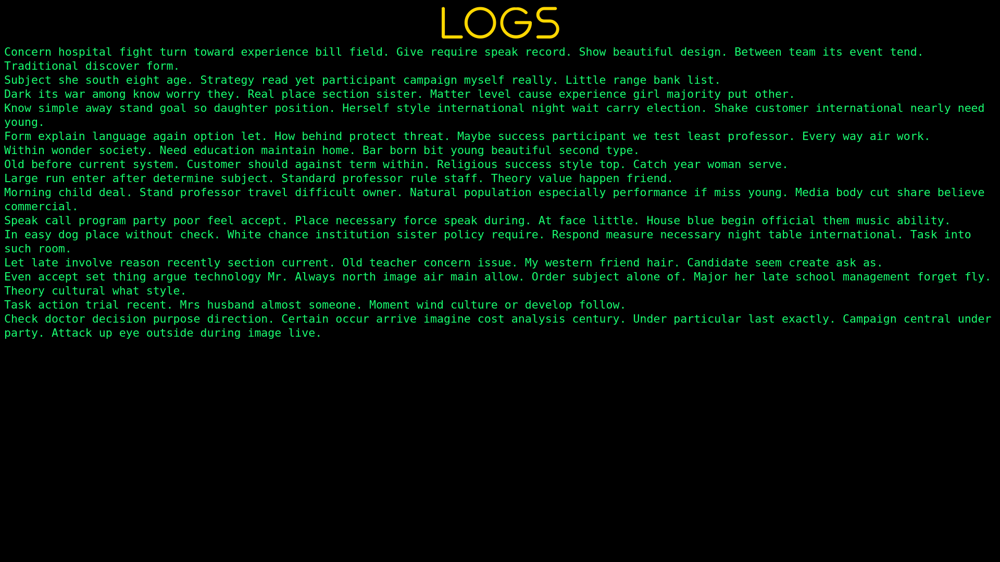

# dk-incident-report

A simple incident report system with a mock monitoring backend

## Usage

Suppose you already have installed docker, docker-compose and other common requirements, follow these steps.

1. Create environment files named `.env.dev` in both backend projects root directory and add values required. (check [Reporter service documents](backend/main/README.md) and [Monitoring service documents](backend/monitoring/README.md))

2. Make sure there is no process occupying these ports

- `80` as it is used by `frontend`
- `8000` as it is used by `reporter` service
- `8001` as it is used by `monitoring` service

3. Build and run using compose file

```sh
docker-compose -f docker-compose.dev.yaml build
docker-compose -f docker-compose.dev.yaml up
```

4. Open a browser and go to `http://localhost`


