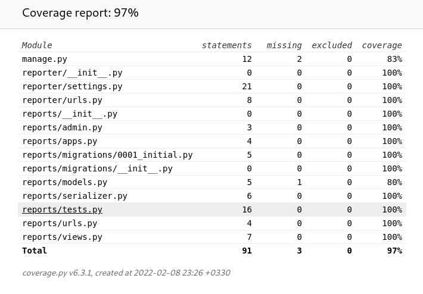
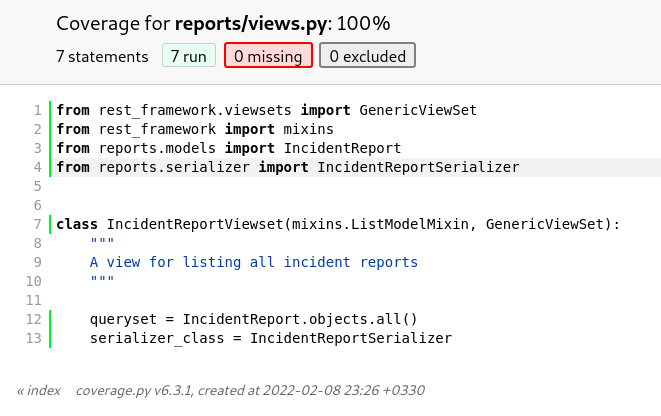
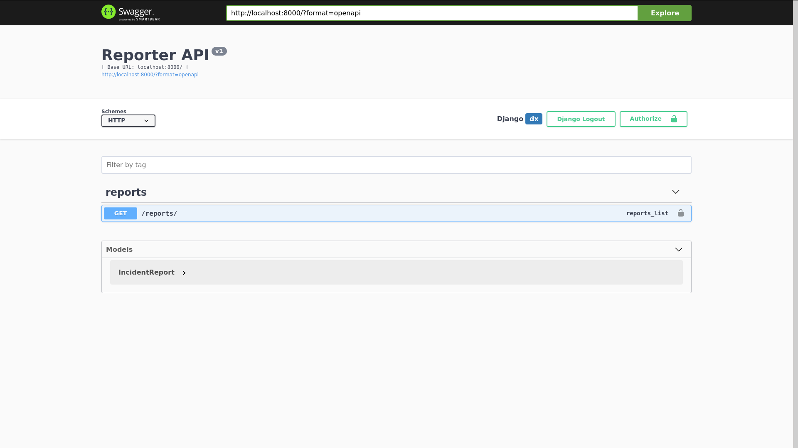

# Reporter

Core backend server which stores logs and serves them to frontend

## Usage

### Environment Variables

These environment variables are required as they are listed below.

| Name                   | Value                           |
| ---------------------- | ------------------------------- |
| DB_HOST                | e.g.: `localhost`                |
| POSTGRES_DB            | e.g.: `reporter`                 |
| POSTGRES_PASSWORD      | e.g.: `somepassword`             |
| POSTGRES_USER          | e.g.: `reporteruser`             |
| DEBUG                  | `0` or `1`                      |
| DJANGO_SECRET_KEY      | some long safe secret           |
| DJANGO_ALLOWED_HOSTS   | django server deployed hostname |
| DJANGO_ALLOWED_ORIGINS | clients origin                  |

### Requirements

Install required python packages

```sh
pip3 install -r requirements.txt
```

### Migration

In order to setup database and populate it execute command below

```sh
sh migrate_and_seed.sh
```

### Tests

Run tests to check if it works properly

```sh
python3 manage.py test
```

In order to check test coverage execute these commands (assuming you have chromium installed)

```sh
coverage run manage.py test
chromium htmlcov/index.html
```





### Run Server

```sh
python3 manage.py runserver
```

## Documentation

Swagger is hosted in root url (e.g.: `http://localhost:8000/`).


