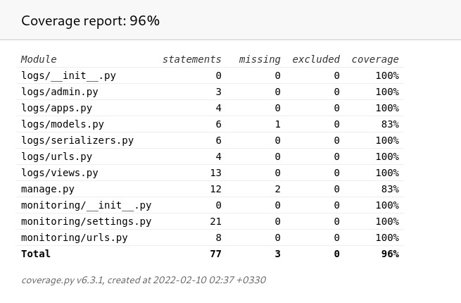
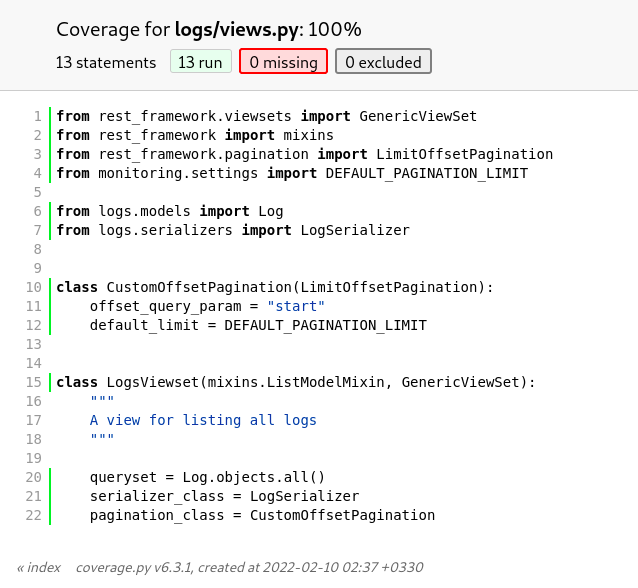
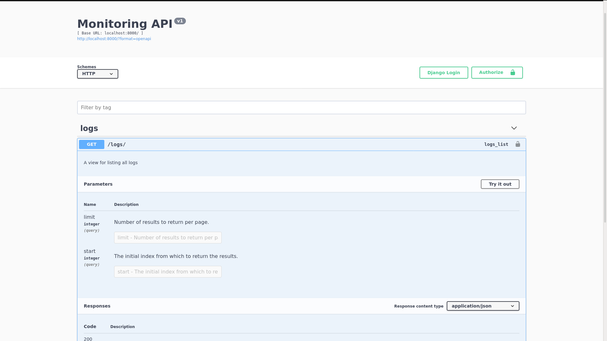

# Monitoring

Mock monitoring server with pre-populated logs.

## Usage

### Environment Variables

These environment variables are required as they are listed below.

| Name                      | Value                           |
| ------------------------- | ------------------------------- |
| DB_HOST                   | e.g.: `localhost`               |
| POSTGRES_DB               | e.g.: `monitoring`              |
| POSTGRES_PASSWORD         | e.g.: `somepassword`            |
| POSTGRES_USER             | e.g.: `monitoringuser`          |
| DEBUG                     | `0` or `1`                      |
| DJANGO_SECRET_KEY         | some long safe secret           |
| DJANGO_ALLOWED_HOSTS      | django server deployed hostname |
| DJANGO_SUPERUSER_USERNAME | username                        |
| DJANGO_SUPERUSER_PASSWORD | password                        |
| DJANGO_SUPERUSER_EMAIL    | email                           |

### Requirements

Install required python packages

```sh
pip3 install -r requirements.txt
```

### Migration

In order to setup database and populate it execute command below

```sh
sh migrate_and_seed.sh
```

### Tests

Run tests to check if it works properly

```sh
python3 manage.py test
```

In order to check test coverage execute these commands (assuming you have chromium installed)

```sh
coverage run manage.py test
coverage html
chromium htmlcov/index.html
```





### Run Server

```sh
python3 manage.py runserver
```

## Documentation

Swagger is hosted in root url (e.g.: `http://localhost:8000/`).


